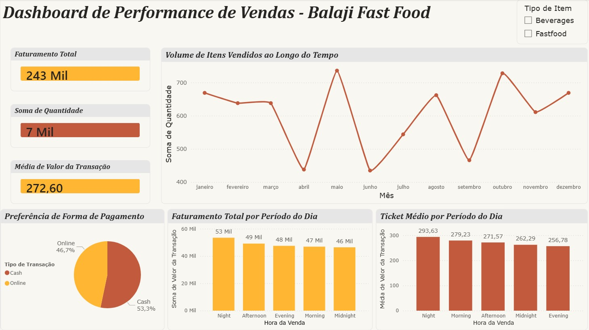

# Dashboard de Performance de Vendas - Balaji Fast Food 📊🍔

Este projeto foi desenvolvido com o objetivo de transformar dados brutos de uma operação de fast-food em insights estratégicos para a gestão do negócio. O painel centraliza indicadores-chave de performance (KPIs) para permitir uma tomada de decisão rápida e baseada em dados reais.

---

## 🎯 Objetivos de Negócio

O dashboard foi estruturado para responder a perguntas cruciais para a operação e planejamento estratégico:
* **Faturamento por período do dia:** Identificar os horários de maior pico para otimização de equipe e controle de estoque.
* **Ticket Médio:** Avaliar o valor médio gasto por pedido para entender o comportamento do consumidor.
* **Volume e mix de vendas:** Mapear a saída real dos produtos e categorias mais vendidas.

---

## 🛠️ Tecnologias e Ferramentas Utilizadas

* **Microsoft Excel:** Utilizado para a etapa inicial de extração, tratamento, limpeza e modelagem dos dados brutos.
* **Microsoft Power BI:** Utilizado para a criação das medidas em DAX (Data Analysis Expressions), design de interface e construção dos visuais interativos.

---

## 📈 Insights Gerados e Funcionalidades

* **Faturamento Total e Transações:** Visualização rápida do faturamento acumulado e do volume total de itens vendidos.
* **Análise por Período:** Gráficos que revelam os comportamentos de consumo nos períodos da manhã, tarde, noite e madrugada.
* **Segmentação Dinâmica:** Filtros interativos por tipo de item (Bebidas ou Fast-food) para uma análise granular da performance.

---

## 💻 Como Visualizar o Projeto

### Análise Técnica (.pbix)
Para profissionais técnicos ou recrutadores que desejam avaliar a estrutura do modelo de dados, as fórmulas DAX aplicadas ou o tratamento de dados no Power Query, o arquivo original está disponível para download neste repositório.

---

## 📷 Visualização do Painel

